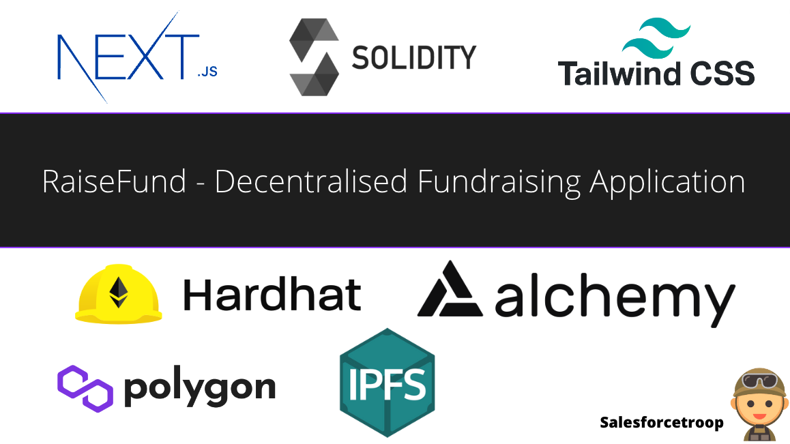
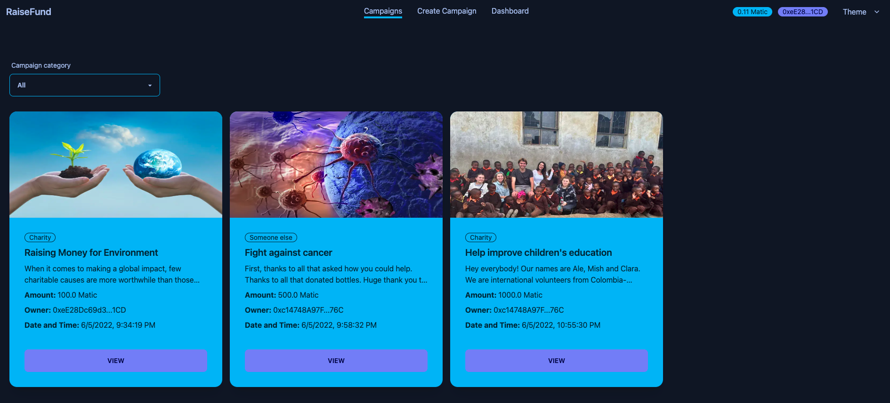
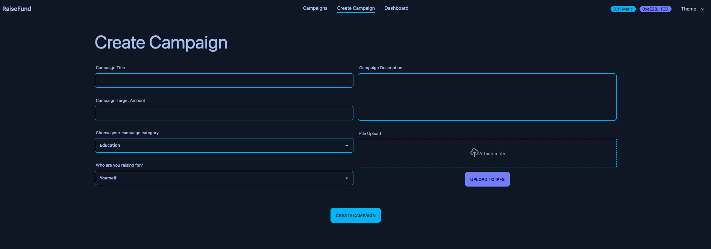
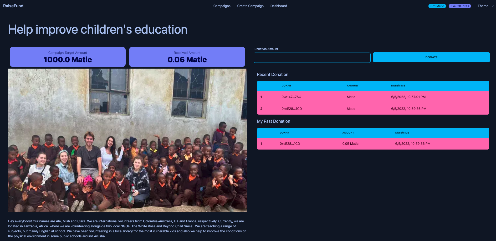

## RaiseFund 

It is a Decentralised Fundraising Application built using Nextjs, Solidity, IPFS, Hardhat, Alchemy and Tailwind css
## Basic commands 
To install packages
```
yarn install
```

To run project
```
npm run dev
```

To create hardhat config file use 
```
npx hardhat init
```

To compile
```
npx hardhat compile
```

To deploy
```
npx hardhat run scripts/deploy.js
```

## Screenshots



### Campaigns Listing Screen


### Create Campaign Screen


### Campaign Donation Screen


